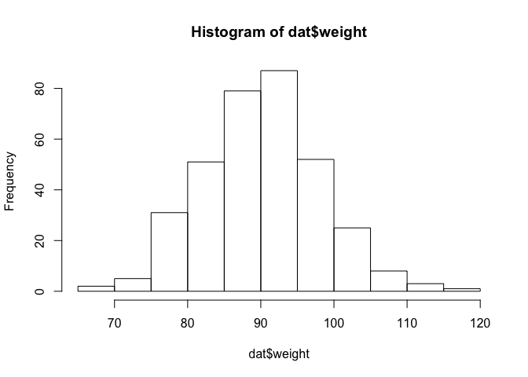

## RStudio Layout

The RStudio layout is broken up into four panes: **Source**, **Console**, **Environment (history/connections)** and **Files (plots/packages/etc)**.  Within these panes there are additional tabs and we will go over the most important ones.  


\
The **Source** pane is where you can read, edit, and run your R code and the code can be saved as a *.R* file indicating it is an R script document.

{ width=75%}

\
An R document is written as a normal text document, however each line is a line of code in R.  However if you highlight a line and click **Run** (or type command-return), then the line of code will be executed and this activity will be displayed in the **Console**.

The **Console** pane is where the R code is executed and results are displayed, as well as other messages and warnings.

{width=60%}

\
The **Environment** pane lists all available data and variables in the current session.  For example, in the example **Source** pane above I have a line of code `another_variable <- 5` which sets the string `another_variable` to represent the value 5.  After executing this line of code, the variable is stored and can be called at any point.  Once a variable has been created, it will be displayed in the **Environment**.  

*Note*: Whenever opening a script into a new session of R, you will need to re-run the lines of code you wish to use.  Opening a .R script does not automatically run the code.

{ width=75%}

\
The **Files** pane is used to navigate through directories and can be used to open files directly into RStudio.  This will be useful when importing data into R.

{ width=75%}

\
Next to the **Files** tab, there is **Plots**.  In the example **Source** pane above I created a plot with the following code (*note*: the function `ggplot()` and the `mpg` dataset are from the `ggplot2` package that comes in the `tidyverse` package. You need to have `tidyverse` installed and loaded for this code to work on your console, this is addressed further down). 

```r
p <- ggplot(data = mpg) +
        geom_point(mapping = aes(x = displ, y = hwy))
p
```
\
When this code is executed, the resulting scatterplot is displayed in the **Plots** tab.

{ width=60%}

\

Also useful is the **Help** tab for understanding what a function does.

### RStudio Project

Now that you understand the visual layout of RStudio, let's start using it.  First you will create a **Project** which helps organize the work you do.  In the top right of RStudio, click on the **blue R icon** (next to it should be a label that says Project: None, if you are not already in a project) and select **New Project...**.  If there is a prompt about saving workspace data, you can select **Don't Save**.

Then, select **New Directory** and under Project Type, select **New Project**.  Give your new directory (folder) a name and location (perhaps somewhere relevant in your BIO416 folder?), and create your project. RStudio will quit and reload with your new project.  If you are successfully in your new project, you will see the name you gave it in the top right hand corner of the RStudio screen.  

You have now created your first RStudio project!


## Import and Tidy Data

We will be working with northern saw-whet owl banding data. 

{ width=50%}

\

Download the banding data and save it as `NSWO_data.xls` in the same directory as your RStudio project.  Once you have done this and you click the refresh arrow under the **Files** tab, you should see `NSWO_data.xls` listed under **Files**. 

At the top of the screen, go to *File*, *New File*, *R Script*.  

In order to import data from a .xls file, we will need a special function that is not in the base R software.  You will commonly use functions that are not in the base software but you can download them in packages.  In the **Console** enter:   


```r
install.packages("tidyverse")
```

This may take a couple minutes.  The *tidyverse* is a large conglomerate of useful packages, and if you go on to use R more then you should definitely get to know the tidyverse.

Once you have finished installing the package, go to your **Source** pane and enter the following code:


```r
# load 'tidyverse' and 'readxl' packages
library(tidyverse)
library(readxl)
```

Run this code by selecting it and clicking **Run**, or type Command-enter when it is selected.  The function `library()` opens the package into the current work session.  At the start of your rscript you should always have the `library()` functions with the packages you will need for your script (however, `install.packages()` only needs to be done once for your computer).  The pound sign delineates comments, which are not run as code. Annotating your R scripts with comments is very useful for sharing them with other people, as well as remembering what you are doing and to help shape your workflow.  To import the owl banding data, enter and run:


```r
# import NSWO data from excel file
dat <- read_excel("NSWO_data.xls")
# tidy up the dataset by removing all of the rows that have any NA values
dat <- drop_na(dat)
```

The variable `dat` should now appear under **Environment**.  If you click on `dat`, an external window will open showing you the owl banding data. Also under **Environment** are the number of observations (rows) and number of variables (columns) of the dataset. In R, `<-` is used to store an action to a variable. In the **Console**, if you enter `5 + 2` then you will receive the value 7, however you can also store that value as a variable. For example, `owls <- 5 + 2` would store the value 7 in the variable `owls`.  Try out some basic arithmetic (+ - * /) in the R console.


```r
5 + 2
```

```
## [1] 7
```

```r
owls <- 5 + 2
owls - 1
```

```
## [1] 6
```

```r
bears <- 5 * 2
bears - owls
```

```
## [1] 3
```
Back to the data...
Some useful functions for checking out data are `head()` and `summary()`, try them out:


```r
summary(dat)
```

```
##       Year          Site              Band #              Wing          
##  Min.   :2007   Length:344         Length:344         Length:344        
##  1st Qu.:2008   Class :character   Class :character   Class :character  
##  Median :2010   Mode  :character   Mode  :character   Mode  :character  
##  Mean   :2010                                                           
##  3rd Qu.:2012                                                           
##  Max.   :2012                                                           
##      Tail              weight              BILL          
##  Length:344         Length:344         Length:344        
##  Class :character   Class :character   Class :character  
##  Mode  :character   Mode  :character   Mode  :character  
##                                                          
##                                                          
##                                                          
##      Date            Ordinal Date   Ordinal Date 2      AGE           
##  Length:344         Min.   :  4.0   Min.   :284.0   Length:344        
##  Class :character   1st Qu.:304.0   1st Qu.:306.8   Class :character  
##  Mode  :character   Median :310.0   Median :312.0   Mode  :character  
##                     Mean   :290.9   Mean   :319.5                     
##                     3rd Qu.:317.0   3rd Qu.:320.0                     
##                     Max.   :360.0   Max.   :437.0                     
##      SEX                Age2          
##  Length:344         Length:344        
##  Class :character   Class :character  
##  Mode  :character   Mode  :character  
##                                       
##                                       
## 
```

```r
head(dat)
```

```
## # A tibble: 6 x 13
##    Year  Site  `Band #`  Wing  Tail weight  BILL  Date `Ordinal Date`
##   <dbl> <chr>     <chr> <chr> <chr>  <chr> <chr> <chr>          <dbl>
## 1  2011  POWA 101412235   135    65   84.4  10.0 40852            308
## 2  2011  POWA 101412234   141    71   80.4  10.6 40852            308
## 3  2011  POWA 101412236   140    70     95  10.2 40853            309
## 4  2010  POWA 101412208   131    66   79.2   9.9 40488            309
## 5  2011  POWA 101412237   136    68   84.8  10.6 40853            309
## 6  2010  POWA 101412209   143    70  100.7  10.6 40489            310
## # ... with 4 more variables: `Ordinal Date 2` <dbl>, AGE <chr>, SEX <chr>,
## #   Age2 <chr>
```

`summary()` provides some basic information on each of the columns, such as the number of observations (Length) and also the class of the data. Class is also provided under the column titles in the output from `head()`.  Character strings should be under class *character* and numeric values will be classified as either *integer* or *double*.  

The `head()` function lists the first 6 rows of the data and specifies that the data is in the format of a *tibble*. Suprisingly, some of the numeric values are classified as characters, which we can fix with `type_convert()`.  Also, two of the column names have spaces in them (`Band #` and `Ordinal Date`) which should always be avoided.  We can also fix this with `rename()`:


```r
# Reclassify column types
dat <- type_convert(dat)
# Rename columns with spaces in the names
dat <- rename(dat, band = 'Band #', ordinal_date = 'Ordinal Date', ordinal_date2 = 'Ordinal Date 2')
head(dat)
```

```
## # A tibble: 6 x 13
##    Year  Site      band  Wing  Tail weight  BILL  Date ordinal_date
##   <dbl> <chr>     <chr> <int> <int>  <dbl> <dbl> <chr>        <dbl>
## 1  2011  POWA 101412235   135    65   84.4  10.0 40852          308
## 2  2011  POWA 101412234   141    71   80.4  10.6 40852          308
## 3  2011  POWA 101412236   140    70   95.0  10.2 40853          309
## 4  2010  POWA 101412208   131    66   79.2   9.9 40488          309
## 5  2011  POWA 101412237   136    68   84.8  10.6 40853          309
## 6  2010  POWA 101412209   143    70  100.7  10.6 40489          310
## # ... with 4 more variables: ordinal_date2 <dbl>, AGE <chr>, SEX <chr>,
## #   Age2 <chr>
```

## Transform and Visualize Data

Now, the column classes now seem more appropriate, but some seem like they don't align - why is `Band_Number` still listed as a character?  Discrepancies such as this may indicate there are character values somewhere in the column that prevent the column from being considered a numerical class.  It should be noted that NA (not available) values are still present under numerical columns.  Try `summary()` on the data now and see how the numerical columns are summarized.

To look at number of observations (samples/rows) or number of variables (columns):


```r
# number of rows
nrow(dat)
```

```
## [1] 344
```

```r
# number of columns
ncol(dat)
```

```
## [1] 13
```

You can check the values present in the specific columns.  This is an extremely useful function.  I use unique a lot to check columns of data to see if they have the values I would expect.


```r
# unique values under AGE column, column is specified by $
unique(dat$AGE)
```

```
## [1] "ASY" "HY"  "SY"
```

```r
# unique values under SEX column
unique(dat$SEX)
```

```
## [1] "U" "F" "M"
```

Using these specific values you can select parts of the dataset based on different attributes. To select only observations of female owls:


```r
filter(dat, SEX == 'F')
```

```
## Warning: package 'bindrcpp' was built under R version 3.3.2
```

```
## # A tibble: 217 x 13
##     Year  Site      band  Wing  Tail weight  BILL       Date ordinal_date
##    <dbl> <chr>     <chr> <int> <int>  <dbl> <dbl>      <chr>        <dbl>
##  1  2011  POWA 101412236   140    70   95.0  10.2      40853          309
##  2  2010  POWA 101412209   143    70  100.7  10.6      40489          310
##  3  2010  POWA 101412210   141    71  101.6  10.6      40489          310
##  4  2011  POWA 101412246   139    70   92.5  11.6      40859          315
##  5  2009  POWA  92408883   136    64  102.9  10.5 11/14/2009          317
##  6  2011  POWA  92430384   141    71   98.3  10.3      40867          323
##  7  2008  POWA  92408856   137    67   90.7  10.7      39459           11
##  8  2008  POWA  92408858   132    69   89.2  11.1      39465           17
##  9  2008  POWA  92408861   140    68   90.9  10.4      39474           26
## 10  2008  POWA  92408863   140    66   87.6   9.9      39481           33
## # ... with 207 more rows, and 4 more variables: ordinal_date2 <dbl>,
## #   AGE <chr>, SEX <chr>, Age2 <chr>
```

Using the `filter()` you can easily specify additional filters, such as after-second-year birds:


```r
filter(dat, SEX == 'F', AGE == 'ASY')
```

```
## # A tibble: 53 x 13
##     Year  Site      band  Wing  Tail weight  BILL       Date ordinal_date
##    <dbl> <chr>     <chr> <int> <int>  <dbl> <dbl>      <chr>        <dbl>
##  1  2011  POWA 101412236   140    70   95.0  10.2      40853          309
##  2  2010  POWA 101412209   143    70  100.7  10.6      40489          310
##  3  2010  POWA 101412210   141    71  101.6  10.6      40489          310
##  4  2011  POWA 101412246   139    70   92.5  11.6      40859          315
##  5  2009  POWA  92408883   136    64  102.9  10.5 11/14/2009          317
##  6  2011  POWA  92430384   141    71   98.3  10.3      40867          323
##  7  2008  POWA  92408856   137    67   90.7  10.7      39459           11
##  8  2008  POWA  92408858   132    69   89.2  11.1      39465           17
##  9  2008  POWA  92408861   140    68   90.9  10.4      39474           26
## 10  2008  POWA  92408863   140    66   87.6   9.9      39481           33
## # ... with 43 more rows, and 4 more variables: ordinal_date2 <dbl>,
## #   AGE <chr>, SEX <chr>, Age2 <chr>
```

Using `nrow()`, you can then determine the number of samples that fit these specifications


```r
# Number of observations of female, ASY birds in the dataset
nrow(filter(dat, SEX == 'F', AGE == 'ASY'))
```

```
## [1] 53
```

Use your R skills to determine the following:
How many samples are male? How many samples have a tail shorter than 70?

As we saw earlier, you can use `summary()` to get some basic column information such as maximum, minimum, and mean.  Here are other ways to do the same tasks.


```r
# Average bill size
mean(dat$BILL)
```

```
## [1] 10.62895
```

```r
median(dat$BILL)
```

```
## [1] 10.6
```

```r
# Largest weight value
max(dat$weight)
```

```
## [1] 117.1
```

What is the median of `ordinal_date`? Is that meaningful?

Histograms provide a quick visualization of the distribution of data and they are easy to perform in R.


```r
# Histogram of owl weight data
hist(dat$weight)
```

<!-- -->

What do the distributions of wing, tail, and bill look like?

## Statistics
### T-test

To run a t-test, use the function `t.test()`.  Inside the function, you will provide the parts of the dataset that are being compared, in the format `y~x`, where y is the response and x is the two groups.  For example, to compare the masses of male and female owls:


```r
# specify the response, make sure to use the exact column names and specify the dataset
t.test(weight ~ SEX, data = dat)
```

What happens? How can we view all of the different levels under the column for the sex of the owls?  What other values are there?

To select observations of only known male and female owls we can use `filter()` again:


```r
# create new dataset with only known M and F values
dat_mf <- filter(dat, SEX == 'M' | SEX == 'F')
# save the t.test result
t <- t.test(weight ~ SEX, data = dat_mf)
t
```

```
## 
## 	Welch Two Sample t-test
## 
## data:  weight by SEX
## t = 22.285, df = 65.201, p-value < 2.2e-16
## alternative hypothesis: true difference in means is not equal to 0
## 95 percent confidence interval:
##  15.76310 18.86634
## sample estimates:
## mean in group F mean in group M 
##        94.86088        77.54615
```

To just show the p-value of the test:

```r
t$p.value
```

```
## [1] 3.359841e-32
```

Significant?  What is this telling us about the difference in weights between the two sexes?

We can plot the mean of the weight for each sex to help visualize the differences.  


```r
# create plot with ggplot(), add bar for mean, add confidence intervals
p <- ggplot(data = dat, aes(x = SEX, y = weight, fill = SEX)) +
      stat_summary(fun.y = mean, geom = "bar") + 
      stat_summary(fun.data = mean_se, geom = "errorbar")
p
```

<!-- -->

### ANOVA

To compare multiple groups we can use an analysis of variance test (ANOVA).  We can use this to compare weights of all the sex groups: M, F, and U ( Do you remember what function you would use to display these values? ):


```r
# Compute the analysis of variance and save the output
aov.dat <- aov(weight ~ SEX, data = dat)
# summary of the ANOVA
summary(aov.dat)
```

```
##              Df Sum Sq Mean Sq F value Pr(>F)    
## SEX           2  14225    7112   296.5 <2e-16 ***
## Residuals   341   8180      24                   
## ---
## Signif. codes:  0 '***' 0.001 '**' 0.01 '*' 0.05 '.' 0.1 ' ' 1
```
Significant?

The summary of the ANOVA only provides an overall p-value.  We can use a Tukey Honest Significant Differences test to do a pairwise comparison of each of the groups.


```r
TukeyHSD(aov.dat)
```

```
##   Tukey multiple comparisons of means
##     95% family-wise confidence level
## 
## Fit: aov(formula = weight ~ SEX, data = dat)
## 
## $SEX
##           diff       lwr        upr p adj
## M-F -17.314722 -19.32000 -15.309444     0
## U-F -10.754057 -12.21118  -9.296937     0
## U-M   6.560664   4.34275   8.778579     0
```


### Linear Regression

One common tool for visualizing numerical data and examining relationships is the scatterplot.  Let's compare the wing and tail length values of saw-whet owls and see if any relationships emerge:


```r
# create plot with ggplot()
p <- ggplot(data = dat, aes(x = Tail, y = Wing)) +
        geom_point()
p
```

<!-- -->

We can make this more informative by adding color. Let's color each point by sex.


```r
# create plot with ggplot()
p <- ggplot(data = dat, aes(x = Tail, y = Wing, col = SEX)) +
        geom_point()
p
```

<!-- -->

This shows that male owls tend to have smaller wings and tails than the female owls.  How does this compare to the analysis on weight above?

Knowing that the female owls are significantly larger overall than the males is important for future analyses.  We will need to account for this known difference in size.  For future analyses we can filter datasets for only male or female.  Here is an example of filtering a dataset just for female owls, and then use it in a linear regression.


```r
# filter dataset for only observations of female owls
female_dat <- filter(dat, SEX == 'F')
# create a linear model (lm), which in this case is linear regression, for Tail and Wing data
fit.f <- lm(Wing ~ Tail, data = female_dat)
# display a summary of the test
summary(fit.f)
```

```
## 
## Call:
## lm(formula = Wing ~ Tail, data = female_dat)
## 
## Residuals:
##      Min       1Q   Median       3Q      Max 
## -10.7038  -2.1821   0.1005   2.3396   8.0571 
## 
## Coefficients:
##              Estimate Std. Error t value Pr(>|t|)    
## (Intercept) 120.91979    6.02762  20.061  < 2e-16 ***
## Tail          0.23915    0.08589   2.784  0.00584 ** 
## ---
## Signif. codes:  0 '***' 0.001 '**' 0.01 '*' 0.05 '.' 0.1 ' ' 1
## 
## Residual standard error: 3.294 on 215 degrees of freedom
## Multiple R-squared:  0.0348,	Adjusted R-squared:  0.03031 
## F-statistic: 7.753 on 1 and 215 DF,  p-value: 0.005842
```
We can add the residual data from the linear model back to the dataset for female owls. We will create a new column named residuals in `female_dat` from the linear model data in `fit.f` 


```r
# `female_dat$residuals` creates a column named 'residuals' in the 'female_dat' tibble, and the residuals from fit.f are added
female_dat$residuals <- fit.f$residuals
```


We can plot these data points and add a line to the graph that depicts the best fit line from the linear model

```r
# add best fit line
p <- ggplot(data = female_dat, aes(x = Tail, y = Wing)) +
        geom_point() +
        stat_smooth(method = "lm", col = "red")
p
```

<!-- -->

The best fit line is created by minimizing the distance between all of the actual points and the line itself.  The distance from the line for each of the points is the residual.


